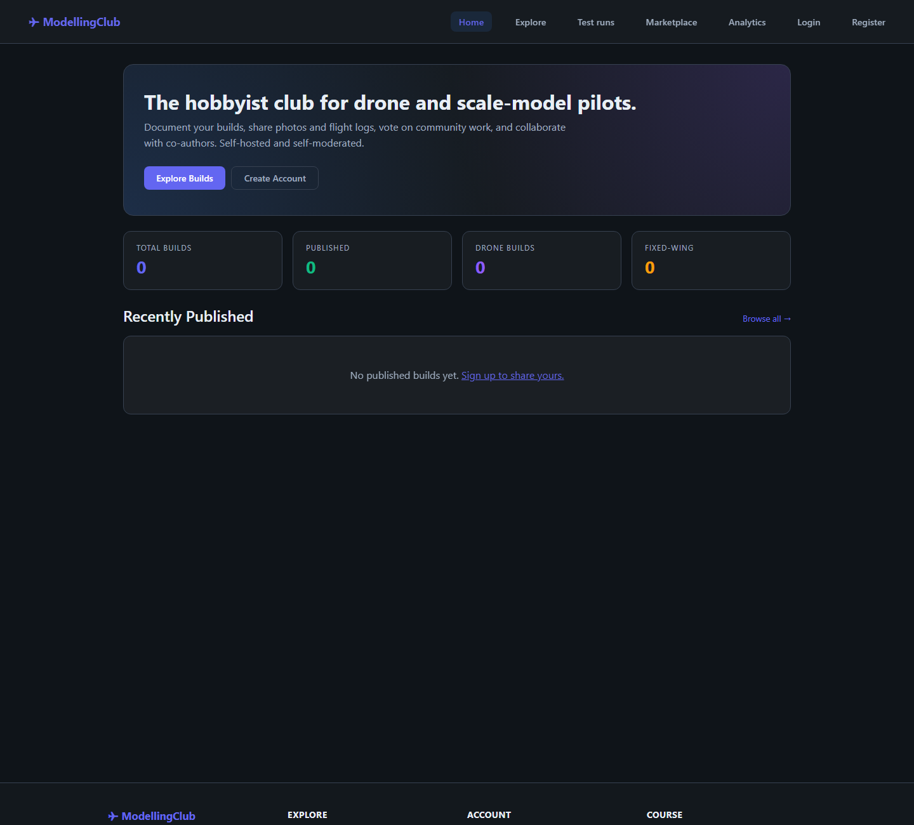
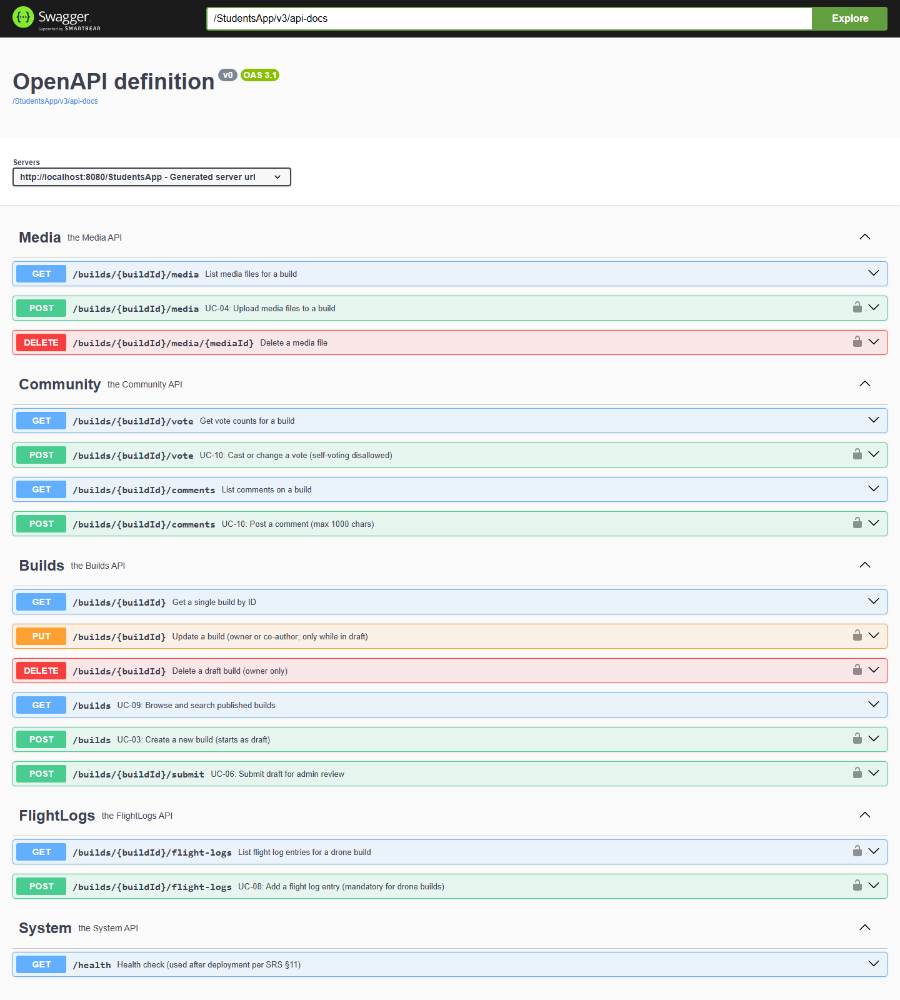
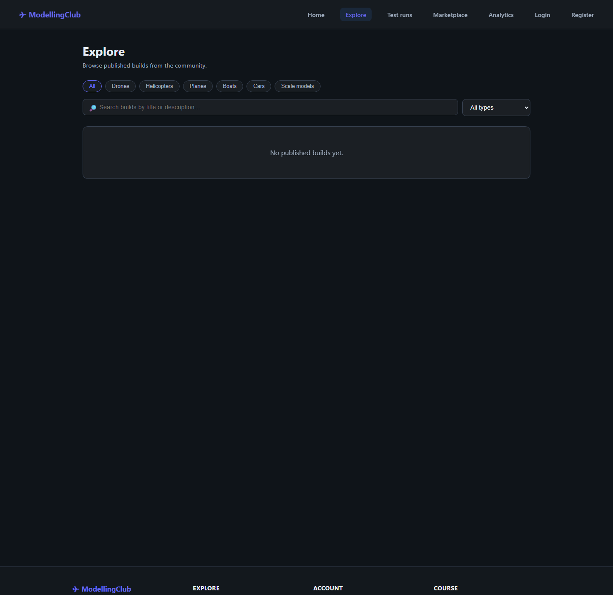
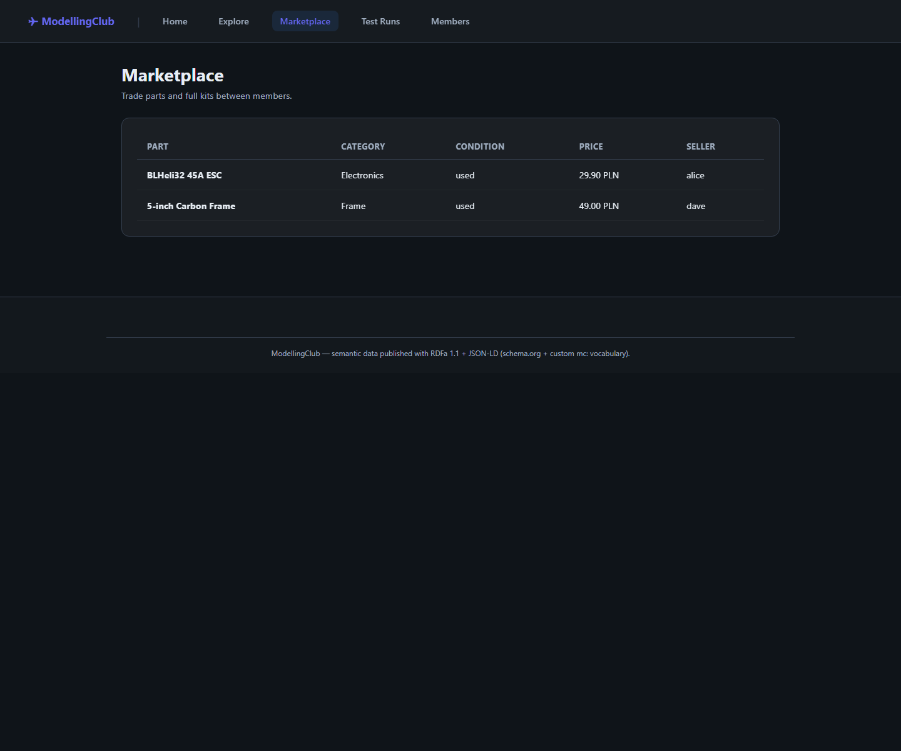
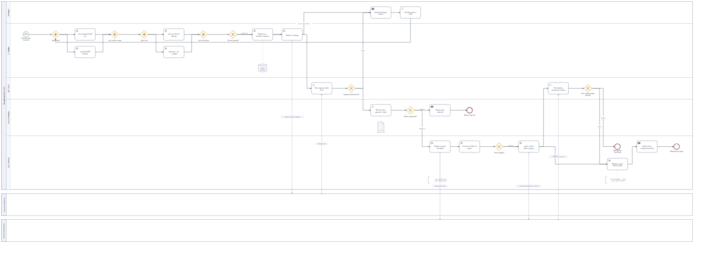
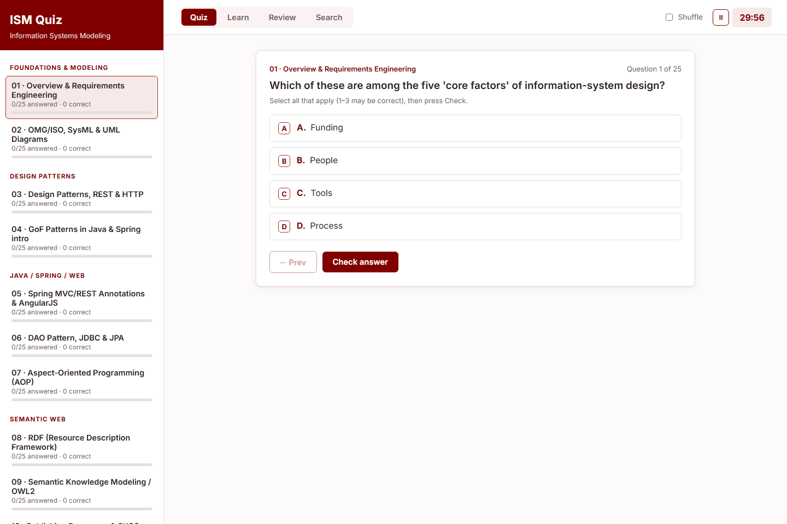

# Information Systems Modelling — One Domain, Seven Labs

This repository tells a single story. Across **seven labs** we take **one**
domain — *ModellingClub*, a community platform where hobbyists share RC-car,
drone, robot and scale-model builds — and carry it through the **entire software
development life cycle (SDLC)**: from a requirements document, to a working
full-stack product, to a formal ontology, to search-engine-ready semantic
publishing, and finally to the operational processes that keep the system alive.

Read top to bottom and it reads like a build diary: each lab picks up exactly
where the last one left off.

> **The domain:** *ModellingClub* — accounts and roles (Guest, Member, Admin),
> a build lifecycle (draft → review → published), media uploads, collaboration
> invites, flight logs for UAV builds, public browsing, comments and voting —
> all under GDPR and EU drone-compliance rules.

<p align="center">
  
</p>

<p align="center"><sub><b>One domain, seven labs.</b> <i>ModellingClub</i> carried through the full SDLC — shown here at its midpoint: the Lab 4 full-stack product (Spring Boot + Angular).</sub></p>

## Screenshots

One representative view per chapter of the arc — every image is a real capture from that lab's own build.

<table>
  <tr>
    <td width="50%" valign="top">
      
      <br><sub><b>Labs 2–3 · API-first backend.</b> An OpenAPI contract and a JWT-secured Spring Boot service, browsable in Swagger UI.</sub>
    </td>
    <td width="50%" valign="top">
      
      <br><sub><b>Lab 4 · Full-stack product.</b> The Angular front end browsing builds against the live backend, with auth and uploads.</sub>
    </td>
  </tr>
  <tr>
    <td width="50%" valign="top">
      
      <br><sub><b>Lab 5 · Formal ontology.</b> The domain modelled in RDF/OWL and queried live over SPARQL.</sub>
    </td>
    <td width="50%" valign="top">
      
      <br><sub><b>Lab 6 · Semantic web.</b> The same data republished as Linked Data (RDFa + JSON-LD) — machine-readable and SEO-ready.</sub>
    </td>
  </tr>
  <tr>
    <td width="50%" valign="top">
      
      <br><sub><b>Lab 7 · Process modelling.</b> The operational life cycle in BPMN 2.0 (here, the CI/CD pipeline).</sub>
    </td>
    <td width="50%" valign="top">
      
      <br><sub><b>Bonus · Exam trainer.</b> A self-contained 570-question quiz app covering the whole course.</sub>
    </td>
  </tr>
</table>

---

## The arc at a glance

| Lab | Chapter of the story | Discipline | Stack / notation |
|-----|----------------------|------------|------------------|
| **1** | *Know the problem* — capture requirements | Requirements engineering | PDF specification |
| **2** | *Agree the interface* — an API-first contract | Contract-first design | OpenAPI + Spring Boot skeleton |
| **3** | *Make it real & secure* — a working backend | Backend + security | Spring Boot, H2, JWT |
| **4** | *Ship the product* — end-to-end app | Full-stack engineering | Spring Boot + Angular |
| **5** | *Give it meaning* — model the domain formally | Knowledge modelling | RDF4J ontology (RDF/OWL) |
| **6** | *Make it findable* — publish machine-readable data | Semantic Web / SEO | RDFa + JSON-LD, Linked Data |
| **7** | *Keep it running* — model the operational life cycle | Process modelling | BPMN 2.0 |

There's also a bonus chapter — **`ism_final_exam_prep/`**, a 570-question quiz
trainer that covers the whole course. More on that at the end.

---

## Toolbelt (set this up once)

| Tool | Needed for | Notes |
|------|-----------|-------|
| **Git** | everything | clone the repo |
| **Java 21** | labs 2–4 | the Spring Boot backends |
| **Java 11+** | lab 5 | RDF4J demo |
| **Maven 3.9+** | labs 2–5 | or use the bundled wrapper `mvnw` / `mvnw.cmd` |
| **Node.js 20 + npm 10+** | lab 4 frontend | Angular build |
| **Node.js ≥ 18** | labs 6 & 7 | zero-dependency generators — no `npm install` |
| **Python + `rdflib`** | lab 6 (optional) | offline JSON-LD validation |
| **A modern browser** | labs 4, 6 & exam prep | Chrome / Edge / Firefox |

**Ports:** backend (labs 2–4) `http://localhost:8080` · Angular frontend (lab 4)
`http://localhost:4200` · lab 6 dev server `http://localhost:3000`.

**First-time check:** run `java -version`, `node -v`, `npm -v`. If a command is
missing, install that tool and reopen the terminal. If `mvn` isn't found, use the
Maven wrapper (`mvnw.cmd` on Windows, `./mvnw` elsewhere).

---

## Lab 1 — Know the problem *(requirements engineering)*

Every system starts with a question: *what are we actually building?* Lab 1 is
the answer — a requirements specification for the ModellingClub platform.

**What it defines**
- A self-hosted platform for hobbyists to publish and collaborate on builds.
- Three **actors**: Guests (read-only), Members (create & collaborate), Admins
  (moderate).
- **Functional requirements**: accounts, the build lifecycle (draft → review →
  published), media uploads, collaboration invites, UAV flight logs, public
  browsing, comments and voting.
- **Non-functional requirements (NFRs)**: performance, secure authentication,
  backups, accessibility, mobile-friendly UI — plus hard limits (upload size,
  files per build, flight-log rules).
- **Compliance**: GDPR and EU drone regulations, moderation and takedown rules.

Interestingly, the document proposes a Linux / Python / PostgreSQL / Nginx
deployment stack — but the labs deliberately satisfy the **same requirements**
using a Java + Angular stack. The requirements are the contract; the technology
is a choice.

**Deliverable:** `lab1/AlimuzzamanBhuiyan_ISM_a_lab01_pop.pdf` (read it first —
it's the domain reference for every lab that follows).

---

## Lab 2 — Agree the interface *(API-first, contract-first)*

With the requirements understood, the next move isn't to write code — it's to
**design the contract**. Lab 2 specifies the REST API **before** implementing it,
the API-first way, so client and server can be built against a single agreed
shape.

**What was built**
- `lab2/file.yaml` — an **OpenAPI** specification describing the resources and
  endpoints.
- `lab2/StudentService` — a **Spring Boot 3.5.6 / Java 21** skeleton that
  realises the contract, backed by an on-startup **SQLite** database (`test.db`).
- Interactive API docs via **Swagger UI**.

**Run it**
```bash
cd lab2/StudentService
./mvnw spring-boot:run          # Windows: mvnw.cmd spring-boot:run
# Swagger UI: http://localhost:8080/StudentsApp/swagger-ui/index.html
```
To reset: stop the app, delete `test.db`, restart.

---

## Lab 3 — Make it real & secure *(backend + authentication)*

The skeleton grows into a proper backend, and — because the requirements demand
secure accounts — this is where **authentication** arrives.

**What was added**
- `lab3/StudentService_vlab3` — Spring Boot 3.5.6 / Java 21 with a **file-based
  H2** database (real persistence between runs).
- **JWT (JSON Web Token)** stateless authentication: register, log in for a
  token, then send `Authorization: Bearer <token>` on protected endpoints.
- A **health endpoint**, Swagger UI, and the H2 web console.

**Run it**
```bash
cd lab3/StudentService_vlab3
mvn clean compile
mvn spring-boot:run
# Health:  http://localhost:8080/StudentsApp/api/v1/health
# Swagger: http://localhost:8080/StudentsApp/swagger-ui/index.html
# H2 UI:   http://localhost:8080/StudentsApp/h2-ui  (JDBC: jdbc:h2:file:./modellingclubdb, user sa, no password)
```
Auth flow: `POST /auth/register` → `POST /auth/login` (get JWT) → call protected
endpoints with the bearer token. Reset by deleting `modellingclubdb.mv.db` and
`modellingclubdb.trace.db`.

---

## Lab 4 — Ship the product *(full-stack engineering)*

Now it becomes a **product**: a secure Spring Boot API joined to a modern
single-page frontend. This is the flagship lab.

**Backend (`lab4/StudentService`)**
- Seed data for an instant demo.
- **Aspect-Oriented Programming (AOP)** cross-cutting concerns: usage
  statistics, service logging, performance timing and a security audit trail.
- A **global exception handler** returning clean RFC-7807 **`ProblemDetail`**
  responses.
- Separate **dev (H2)** and **production** profiles
  (`application-prod.properties`).
- **File uploads** capped at 20 MB/file and 50 files/build, served under
  `/StudentsApp/uploads/...`.
- **JWT** auth and configurable **CORS** (defaults to the Angular origin).

**Frontend (`lab4/angular-rest-client-student-crud`)**
- An **Angular 21** SPA consuming the REST API (CRUD over the domain).

**Run it (two terminals)**
```bash
# Terminal 1 — backend
cd lab4/StudentService && mvn spring-boot:run
# Terminal 2 — frontend
cd lab4/angular-rest-client-student-crud && npm ci && npm start
# Backend API: http://localhost:8080/StudentsApp/api/v1   ·   Frontend: http://localhost:4200
```

**Demo accounts**

| Role   | Email                     | Password  |
|--------|---------------------------|-----------|
| admin  | admin@modellingclub.local | admin123  |
| member | demo@modellingclub.local  | DemoUser1 |

Production profile: set `JWT_SECRET`, `CORS_ORIGINS`, `APP_PUBLIC_BASE_URL`, then
`mvn spring-boot:run -Dspring-boot.run.profiles=prod`. Reseed by deleting the
`modellingclubdb.*` files and the `uploads/` folder, then restarting.
See `lab4/guide.txt` for a full demo walkthrough.

---

## Lab 5 — Give it meaning *(knowledge modelling)*

The app can store and serve data — but the data has no *formal meaning*. Lab 5
models the ModellingClub domain as an **ontology** so machines can reason about
it, not just display it.

**What was built**
- `lab5/sesameExample_sol` — a **Java 11 / RDF4J 3.6.3** demo.
- `ontology.ttl` — the **TBox** (the vocabulary: classes and properties, the
  `mc:` schema) — and `sample-data.ttl` — the **ABox** (instances).
- Loads both into an in-memory **triplestore** and runs **SPARQL** queries.

**Run it**
```bash
cd lab5/sesameExample_sol
mvn compile exec:java
# Console prints load confirmation + SPARQL query results
```
(Or open it in IntelliJ as a Maven project with a Java 11+ SDK and run
`pl.edu.pwr.modellingclub.App`.)

This ontology is the seed for Lab 6 — the same IRIs and vocabulary get reused.

---

## Lab 6 — Make it findable *(Semantic Web + SEO)*

Here the story turns outward: how does the wider web — search engines, crawlers,
knowledge graphs — *understand* our pages? Lab 6 publishes the domain data as
**machine-readable semantic markup** so it qualifies for rich results and Linked
Data.

**The problem it solves.** A client-rendered Angular view is hostile to crawlers:
a bot fetching the page sees only `<app-root></app-root>` — the real content is
painted later by JavaScript. The industry fix is **server-side rendering /
static site generation (SSR/SSG)**: render the data on the server and embed it in
two machine-readable forms — **RDFa 1.1** attributes woven into the HTML, and a
**JSON-LD** script — favouring the **schema.org** vocabulary, and falling back to
the custom **`mc:`** vocabulary only where schema.org has no matching term
(flight logs, telemetry, reputation…).

**The engineering (this was rebuilt from earlier static pages).** The data is
**not** hand-written into the pages any more. A small **zero-dependency Node app**
(`lab6/app/`) is the **single source of truth** (`app/data/*.json`, the ABox) and
**generates** both the RDFa and the JSON-LD from it, so the two can never drift.

```
app/data/*.json ─► one renderer ─► RDFa + JSON-LD ─┬─► dynamic SSR server (npm run dev)
                                                    └─► static snapshots  (npm run build → app/dist/)
```

It also serves **dereferenceable Linked Data**: every resource IRI answers under
**content negotiation** — `Accept: application/ld+json` returns the RDF graph;
`Accept: text/html` returns a `303` redirect to the human page.

**Run it**
```bash
cd lab6/app
npm run dev        # http://localhost:3000 — pages rendered on each request
npm run build      # writes the static site to app/dist/
npm run validate   # build, then parse every page's JSON-LD with rdflib
```
No `npm install` needed (zero dependencies). `validate` also needs Python +
`rdflib`.

**Verify the markup** with **RDFa Play** (`rdfa.info/play`), the **Schema Markup
Validator** (`validator.schema.org`) and Google's **Rich Results Test** — the
same tooling used for real-world **SEO / structured-data** work. The delivered
custom ontology is `lab6/vocabulary/ontology.ttl` (schema.org and XSD are
existing vocabularies — referenced, not redelivered). Engineering detail lives in
[`lab6/app/README.md`](lab6/app/README.md).

---

## Lab 7 — Keep it running *(BPMN 2.0 process modelling)*

The final chapter zooms out from the *software* to the *organisation around it*.
A running system needs maintenance, deployments, data governance and a business
life cycle — processes governed by rules, good practice and external commitments,
not by application source code. Lab 7 models eight of them in **BPMN 2.0**.

**The eight processes (four themes)**

| Theme | Process |
|-------|---------|
| Maintenance & operations | 1 · Scheduled Backup & Verification · 2 · Software Upgrade / Dependency Patch |
| Deployment & migration | 3 · Release & **Blue-Green Deployment (CI/CD)** · 4 · H2 → PostgreSQL Database Migration |
| Data governance & security | 5 · Data Archiving, Retention & **GDPR Erasure** · 6 · **Security Incident Response** |
| Business life cycle | 7 · Member Onboarding & Hosting Provisioning · 8 · System Decommissioning / End-of-Life |

Each is a BPMN **collaboration** (pools, lanes, sequence flows, message flows)
involving real stakeholders — DevOps, Release Manager, DBA, Data Protection
Officer, Security on-call, Cloud Provider, the GDPR supervisory authority.
Between them they exercise timer/message/signal start events, boundary error and
timer events, exclusive/parallel/event-based gateways, and terminate ends.

**How it's built.** Like lab 6, a **zero-dependency Node generator** holds the
eight processes **once** as a data model (`src/specs.js`) and emits everything
from it, so nothing can drift:

```
src/specs.js ─► generator ─┬─► diagrams/*.svg         (rendered BPMN)
                           ├─► bpmn/*.bpmn            (editable, Camunda-ready, with DI)
                           └─► report/lab7-report.pdf (the deliverable)
```

**Regenerate**
```bash
cd lab7
npm run build     # diagrams/*.svg + bpmn/*.bpmn
npm run pdf       # build + report.html → report/lab7-report.pdf
```
Node ≥ 18; the PDF step drives a headless Chromium (Edge/Chrome). Every `.bpmn`
imports **without warnings** in `bpmn-moddle` (the parser behind Camunda Modeler
/ bpmn.io), and every model was checked against BPMN execution semantics.
Details in [`lab7/README.md`](lab7/README.md).

---

## How it all connects

1. **Lab 1** captures *what* to build (requirements).
2. **Lab 2** freezes the *interface* as an API-first contract.
3. **Lab 3** turns the contract into a *secure, persistent* backend.
4. **Lab 4** ships the full *product* — API + Angular UI.
5. **Lab 5** gives the domain *formal meaning* as an ontology.
6. **Lab 6** *publishes* that meaning to the web for search engines and Linked
   Data consumers.
7. **Lab 7** models the *operational processes* that keep the whole thing alive.

One domain, followed from an idea on paper all the way to a governed, findable,
running system.

---

## Bonus — ISM final exam prep

**`ism_final_exam_prep/`** is a self-contained, zero-dependency quiz trainer for
the ISM final exam: **570 questions** across all 14 lectures plus a 220-question
Test set, with Quiz / Learn / Review / Search modes, a section timer, and
progress saved in the browser. Just open `ism_final_exam_prep/index.html`.
Full guide: [`ism_final_exam_prep/README.md`](ism_final_exam_prep/README.md).

---

## Common fixes (beginner-friendly)

- **`mvn` not found** → use the wrapper: `mvnw.cmd` (Windows) or `./mvnw`.
- **Port 8080 busy** → stop the other app or change `server.port`.
- **`npm install` fails (lab 4)** → delete `node_modules` and
  `package-lock.json`, then run `npm ci`.
- **Wrong Java version** → set `JAVA_HOME` and open a new terminal.
- **Labs 6 & 7 won't start** → they need Node ≥ 18; no `npm install` required.

## Technology

- **Spring Boot, Java, and JPA** — implement the contract-first services and persistent ModellingClub backend across the lifecycle labs.
- **OpenAPI** — fixes the API shape before the service implementation and drives its documented interface.
- **SQLite and H2** — provide the embedded persistence used by the successive backend exercises.
- **Angular** — renders the Lab 4 client that consumes the ModellingClub API.
- **RDF4J** — loads the Turtle ontology into an in-memory repository for SPARQL exploration.
- **Node.js** — runs the zero-dependency semantic publishing and BPMN generators that derive deliverables from their source models.

## Skills demonstrated

- Carrying one domain from requirements through API design, implementation, and operations.
- Building a Java REST service with persistence, authentication, and documented contracts.
- Connecting an Angular client to a backend service.
- Expressing domain semantics in RDF/OWL and querying them with SPARQL.
- Generating semantic-web and BPMN artefacts from maintained source definitions.

## License

MIT ([`LICENSE`](LICENSE)).
