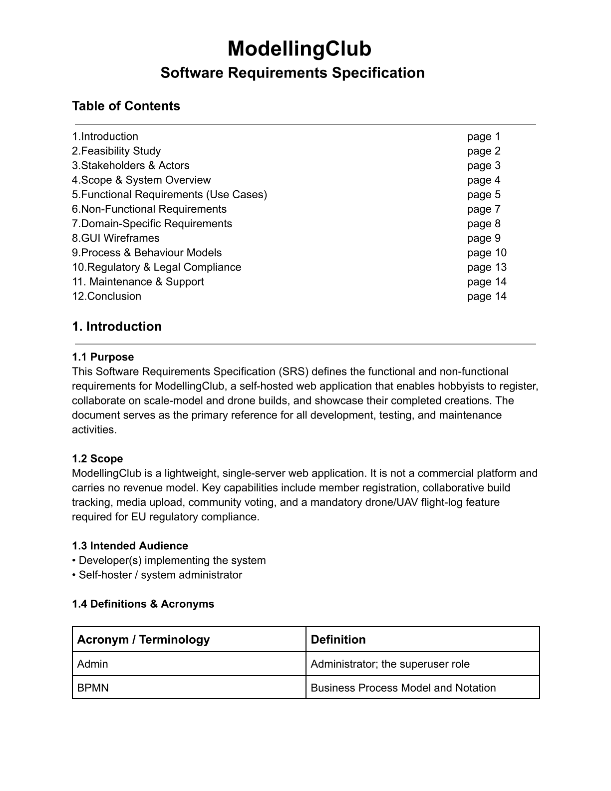

# Lab 1 — Requirements Specification (ModellingClub SRS)

The starting point of the whole project: a **Software Requirements Specification
(SRS)** for *ModellingClub*, a self-hosted platform where hobbyists register,
collaborate on RC / drone / scale-model builds, and showcase their work.

It defines the actors (Guest, Member, Admin), the functional requirements (build
lifecycle, media uploads, flight logs, voting, comments), the non-functional
requirements (performance, security, accessibility, backups) and the regulatory
scope (GDPR + EU drone rules). It is the domain reference for every lab that
follows.

**Deliverable:** [`AlimuzzamanBhuiyan_ISM_a_lab01_pop.pdf`](AlimuzzamanBhuiyan_ISM_a_lab01_pop.pdf)

See the [root README](../README.md#lab-1--know-the-problem-requirements-engineering)
for how this lab fits the lab1→lab7 story.
