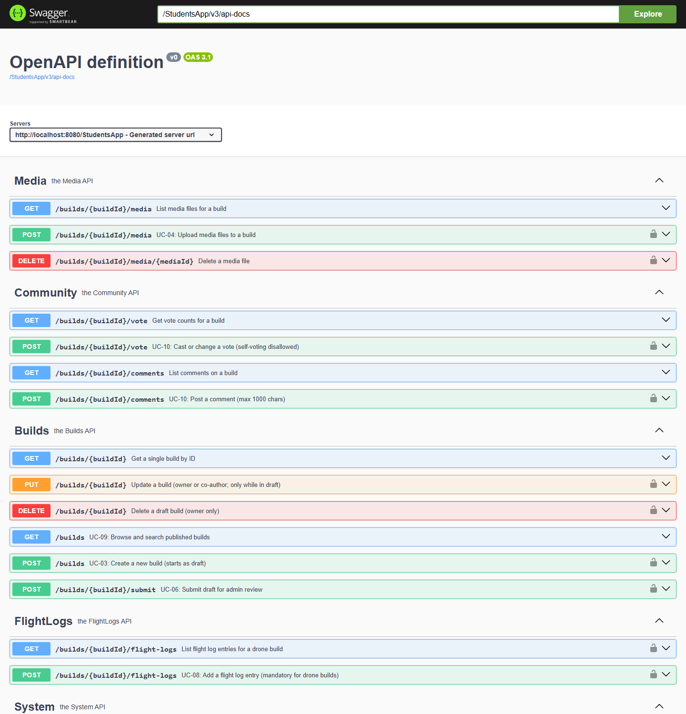

# Lab 2 — API-first contract + Spring Boot skeleton

The requirements from Lab 1 are turned into an agreed **REST API contract**
before any real logic is written. An **OpenAPI** specification
([`file.yaml`](file.yaml)) describes the ModellingClub resources and endpoints,
and a **Spring Boot 3.5.6 / Java 21** skeleton (`StudentService`) realises it,
backed by an on-startup **SQLite** database.

The interactive **Swagger UI** documents every endpoint — Builds, Media,
Community (votes/comments), FlightLogs and System:



## Run

```bash
cd StudentService
./mvnw spring-boot:run          # Windows: mvnw.cmd spring-boot:run
```

Then open <http://localhost:8080/StudentsApp/swagger-ui/index.html>.
To reset: stop the app, delete `test.db`, restart.

See the [root README](../README.md#lab-2--agree-the-interface-api-first-contract-first)
for context.
