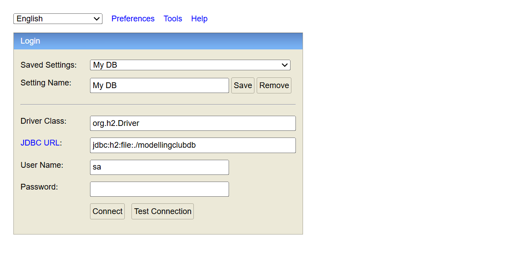

# Lab 3 — Secure backend (JWT + H2)

The skeleton becomes a real backend. `StudentService_vlab3` (Spring Boot 3.5.6 /
Java 21) adds **stateless JWT authentication** — register, log in for a token,
then send `Authorization: Bearer <token>` on protected endpoints — and swaps in a
**file-based H2** database for persistence between runs.

The Swagger UI now exposes the `auth` endpoints alongside the domain API:


The H2 web console lets you inspect the database directly
(`jdbc:h2:file:./modellingclubdb`, user `sa`):



## Run

```bash
cd StudentService_vlab3
mvn clean compile
mvn spring-boot:run
```

- Swagger UI: <http://localhost:8080/StudentsApp/swagger-ui/index.html>
- H2 console: <http://localhost:8080/StudentsApp/h2-ui>

Auth flow: `POST /auth/register` → `POST /auth/login` (get JWT) → call protected
endpoints with the bearer token.

See the [root README](../README.md#lab-3--make-it-real--secure-backend--authentication)
for context.
