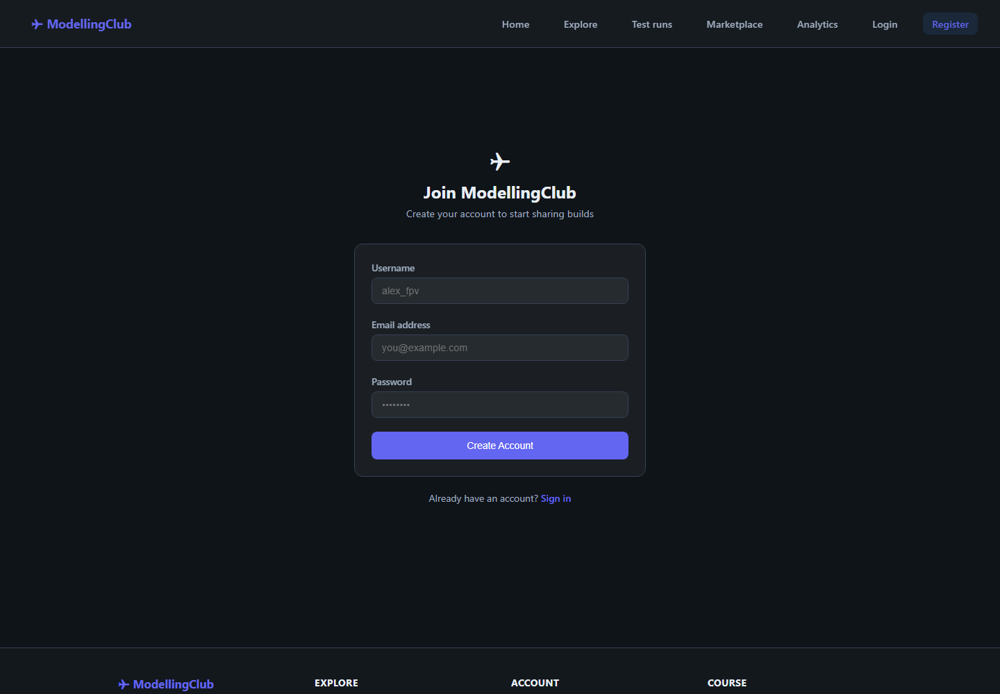

# Lab 4 — Full-stack app (Spring Boot + Angular)

The flagship lab: a secure **Spring Boot** API joined to an **Angular 21**
single-page frontend, delivering the ModellingClub product end to end. The
backend adds seed data, **Aspect-Oriented Programming (AOP)** cross-cutting
concerns (usage stats, logging, performance timing, security audit), RFC-7807
`ProblemDetail` error responses, media uploads and separate dev/prod profiles.

The landing page — hero, primary navigation and live stat tiles:


The account sign-up form (JWT-backed registration):



The frontend also ships **Explore** (browse/filter published builds), **Login**,
**Test runs**, **Marketplace** and **Analytics** views — see
[`screenshots/`](screenshots/).

## Run (two terminals)

```bash
# Terminal 1 — backend
cd StudentService && mvn spring-boot:run
# Terminal 2 — frontend
cd angular-rest-client-student-crud && npm ci && npm start
```

- Backend API: <http://localhost:8080/StudentsApp/api/v1>
- Frontend UI: <http://localhost:4200>

Demo accounts and the full walkthrough are in [`guide.txt`](guide.txt) and the
[root README](../README.md#lab-4--ship-the-product-full-stack-engineering).
