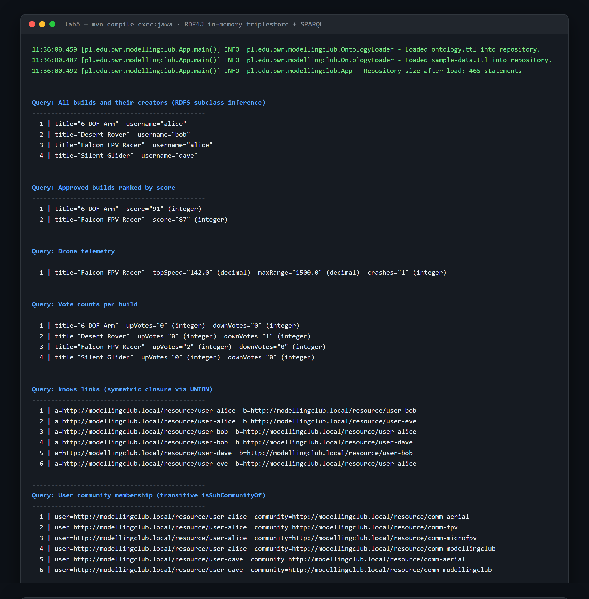

# Lab 5 — Ontology & SPARQL (RDF4J)

The ModellingClub domain is modelled formally as an **ontology** so machines can
*reason* about it, not just store it. `sesameExample_sol` (Java 11 / RDF4J 3.6.3)
loads the **TBox** (`ontology.ttl` — the `mc:` vocabulary of classes and
properties) and the **ABox** (`sample-data.ttl` — instances) into an in-memory
**triplestore**, then runs a series of **SPARQL** queries with **RDFS
inference**.

Running it loads 465 statements and answers eight queries — builds and their
creators, approved builds by score, drone telemetry, votes, symmetric `knows`
links, transitive community membership, marketplace listings and test-run
attendees:



## Run

```bash
cd sesameExample_sol
mvn compile exec:java
```

(Or open it in IntelliJ as a Maven project with a Java 11+ SDK and run
`pl.edu.pwr.modellingclub.App`.)

The IRIs and vocabulary here are reused by Lab 6 to publish the same knowledge on
the web. See the
[root README](../README.md#lab-5--give-it-meaning-knowledge-modelling) for
context.
