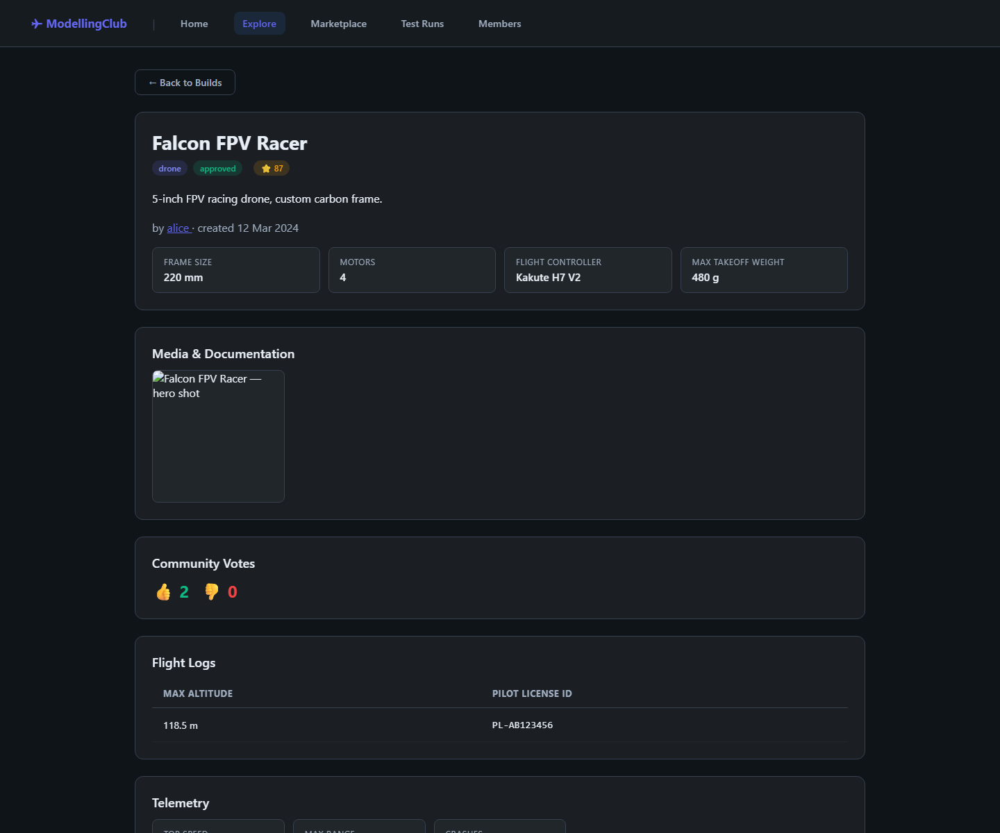
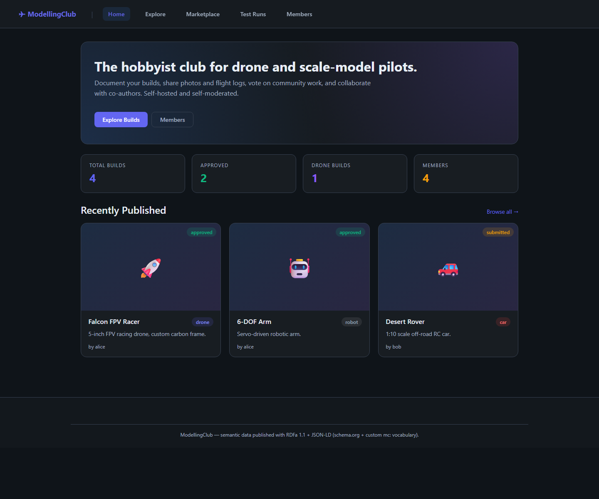

# Lab 6 — Embedding semantic data in web pages (RDFa + JSON-LD)

**Aim:** publish the web application's data as semantic markup using **RDFa 1.1**
(annotations woven into the HTML) and **JSON-LD** scripts, preferring the
**schema.org** vocabulary and falling back to a **custom `mc:` vocabulary** where
schema.org has no matching class/property.

The data is **not** hand-written into the pages. A small zero-dependency Node app
([`app/`](app/)) holds it once (`app/data/*.json`) and **generates** both the
RDFa and the JSON-LD from that single source, so the two representations can
never drift. The app runs two ways:

```
app/data/*.json ─► one renderer ─► RDFa + JSON-LD ─┬─► dynamic SSR server (npm run dev)
                                                    └─► static snapshots  (npm run build → app/dist/)
```

This is the standard fix for the problem the lab poses: a client-rendered
Angular view is invisible to crawlers (a bot sees only `<app-root></app-root>`),
so the data is rendered **server-side** (SSR/SSG) and published in two
machine-readable forms. Either RDFa or JSON-LD alone is enough for a crawler;
both are emitted to demonstrate both techniques and to make validation easy.

Engineering detail (file-by-file) lives in [`app/README.md`](app/README.md).

### Rendered pages

A generated build-detail snapshot (`app/dist/build-falcon.html`) — the header,
media, votes, flight log and telemetry cards each carry the same subject IRI so a
crawler reads them as one entity:



The home page (`schema:WebSite` + `Organization` + an `ItemList` of builds) and
marketplace (`Product` + `Offer`) render from the same JSON source:



---

## 1. Run it

```bash
cd app
npm run dev        # http://localhost:3000  — pages rendered on each request
npm run build      # writes the static site to app/dist/
npm run validate   # build, then parse every page's JSON-LD with rdflib
```

`dev`/`build` need only Node ≥ 18 (no `npm install` — zero dependencies).
`validate` also needs Python + `rdflib` (`pip install rdflib`).

The dynamic server also exposes **dereferenceable Linked Data**: every resource
IRI answers under content negotiation —

```bash
curl -H "Accept: application/ld+json" http://localhost:3000/resource/build-falcon   # the RDF graph
curl -H "Accept: text/html"          http://localhost:3000/resource/build-falcon   # 303 → build-falcon.html
```

---

## 2. Files

```
lab6/
├─ app/                     the dynamic app (single source of truth + renderers)
│  ├─ data/*.json           the ABox: site, users, communities, builds,
│  │                        marketplace, testruns  ← edit this, not HTML
│  ├─ src/                  ns, model, sitemap, server, rdf/, views/
│  ├─ scripts/             build.js (static export) + validate.py
│  ├─ dist/                 GENERATED static site (npm run build)
│  └─ README.md             engineering walk-through
├─ styles.css               dark theme (presentation only); reused by the app
├─ vocabulary/
│  ├─ ontology.ttl          custom mc: ontology (TBox) — DELIVERABLE 3
│  └─ mc-context.jsonld      reusable JSON-LD @context for the mc: terms
├─ guide.txt                step-by-step: run the app + produce the deliverables
├─ snapshot.md              point-in-time technical snapshot
└─ README.md                this file
```

The generated `app/dist/` contains the rendered pages a crawler/SSR build would
emit: `index.html`, `builds.html`, one `build-<slug>.html` per build, one
`member-<name>.html` per member, `marketplace.html`, `testrun.html`, plus copies
of `styles.css` and `vocabulary/`.

The custom ontology (`vocabulary/ontology.ttl`) is the only ontology handed in —
schema.org and XSD are existing vocabularies, referenced in the report, not
delivered.

---

## 3. schema.org ↔ custom vocabulary mapping

schema.org covers most of the domain. Where it does **not**, the custom `mc:`
vocabulary fills the gap (the "missing classes/properties" case the brief asks
about). The renderer applies this rule programmatically.

| Domain thing | schema.org (primary) | Custom `mc:` |
|---|---|---|
| Build | `CreativeWork` (`name`, `description`, `genre`, `author`, `dateCreated`, `creativeWorkStatus`, `aggregateRating`, `comment`, `image`, `additionalProperty`) | `mc:DroneBuild` / `mc:RCCarBuild` / `mc:RobotBuild` / `mc:AircraftBuild`, `mc:buildTitle`, `mc:hasStatus` |
| Up/down votes | `interactionStatistic` → `InteractionCounter` (`LikeAction`/`DislikeAction`) | — |
| **Flight log** | *(no equivalent)* | **`mc:FlightLog`, `mc:flightAltitude`, `mc:pilotLicenseId`** |
| **Telemetry** | *(no equivalent)* | **`mc:TelemetryRecord`, `mc:topSpeed`, `mc:maxRange`, `mc:crashCount`** |
| Marketplace listing | `Product` + `Offer` (`price`, `priceCurrency`, `itemCondition`, `availability`, `seller`) | `mc:MarketplaceListing`, `mc:partName`, `mc:partCategory`, `mc:listedBy` |
| Member | `Person` (`name`, `email`, `knows`, `memberOf`) | `mc:User` / `mc:Builder`, `mc:username`, `mc:registeredAt` |
| **Reputation** | *(no equivalent)* | **`mc:ReputationRecord`, `mc:builderScore`, `mc:helperScore`, `mc:organiserScore`, `mc:reliabilityScore`** |
| Test run | `Event` + `Place` + `PostalAddress` (`startDate`, `organizer`, `attendee`) | `mc:TestRun`, `mc:testRunLocation`, `mc:testRunDate`, `mc:organisedBy`, `mc:attendedBy` |
| Club / community | `Organization` | `mc:Community` |

RDFa wiring (set once in `src/views/components.js`, from `src/ns.js`):
`<html vocab="https://schema.org/" prefix="mc: … mcr: …">`. Bare terms
(`property="name"`) resolve to schema.org; custom terms are prefixed
(`property="mc:flightAltitude"`); types combine both
(`typeof="CreativeWork mc:DroneBuild"`).

**Generated provenance.** Every page opens with a `VOCAB MAP` comment, but it is
no longer hand-maintained — `src/rdf/vocabmap.js` **walks that page's graph** to
list its schema.org terms, its `mc:` terms, and any **custom-ONLY** sub-graph (an
`mc:` type with no schema.org sibling). The custom-only sub-graphs are:

* build detail (drone) → **Flight Logs** (`mc:FlightLog`) and **Telemetry**
  (`mc:TelemetryRecord`);
* member profile → **Reputation** (`mc:ReputationRecord`).

Everywhere else `mc:` is dual-annotated alongside schema.org.

---

## 4. The "scattered `<div>`s" technique

When one entity renders as separate, non-nested elements, RDFa keeps them on one
subject with **`@about`** — every block repeats the subject IRI. The renderer
applies this automatically:

* **build detail** — the header, media, votes, flight-log, telemetry and comment
  `.glass-card`s each carry `about="mcr:build-<slug>"`, so all their triples land
  on the one build.
* **marketplace** — a `<table>` is the worst case: one Offer's data is split
  across the *Condition* `<td>` and the *Price* `<td>`. Both cells use
  `rel="offers" resource="mcr:offer-…"`, so the two sibling cells contribute to
  the **same** Offer node instead of minting two.

Machine values use `content=`/`datatype=` while humans see formatted text, e.g.
`<span property="mc:flightAltitude" datatype="xsd:decimal" content="118.5">118.5 m</span>`.

---

## 5. How to verify

### 5a. RDFa — RDFa Play (<http://rdfa.info/play/>)
Run `npm run build`, open `app/dist/build-falcon.html`, copy the markup into the
editor, choose the **Turtle** output tab. The triples should show
`mcr:build-falcon` as a `schema:CreativeWork` **and** `mc:DroneBuild`, with
`schema:author → mcr:user-alice`, `schema:aggregateRating`, the
`mc:hasFlightLog`/`mc:hasTelemetry` sub-graphs and both comments — and every
scattered card attached to the one subject (no stray blank nodes).

### 5b. JSON-LD + RDFa — Google / schema.org
* **Schema Markup Validator** — <https://validator.schema.org/> (general
  schema.org: `CreativeWork`, `Person`, …).
* **Rich Results Test** — <https://search.google.com/test/rich-results>
  (`Product`, `Event`, `AggregateRating`).

Paste a page's code; expect the items detected with **0 errors**. Custom `mc:`
properties appear as recognised-but-unknown extras (expected — not schema.org
terms).

### 5c. Offline check (in-repo)
`npm run validate` parses every generated page's JSON-LD with `rdflib` and prints
triple counts (333 total across the site; `build-falcon.html` = 76). See
`app/scripts/validate.py`.

---

## 6. Deliverables

1. **Report** (PDF/DOC) — what was done + verification (RDFa Play) and checking
   (Google / schema.org validator) screenshots + ontology references.
2. **Rendered source** — the generated `app/dist/` (or the live `npm run dev`
   server), which carries the RDFa + JSON-LD, plus `styles.css` and
   `vocabulary/mc-context.jsonld`. The data + renderers in `app/` are the source
   these are built from.
3. **Custom ontology** — `vocabulary/ontology.ttl` ONLY. schema.org and XSD are
   existing vocabularies → referenced in the report, **not** delivered.

---

## 7. Notes
* Subjects reuse the lab5 triplestore IRIs (`http://modellingclub.local/resource/…`),
  so a page scraped into a triplestore merges with the lab5 graph — the website
  is a publishing front-end for the same knowledge base.
* `priceCurrency` is `PLN` to match the lab4 marketplace.
* Use the **drone build detail** page when demonstrating: it exercises every
  technique — dual vocab, scattered-`div` `@about`, typed literals, nested
  resources, `AggregateRating`, and the custom-only sub-graphs.
